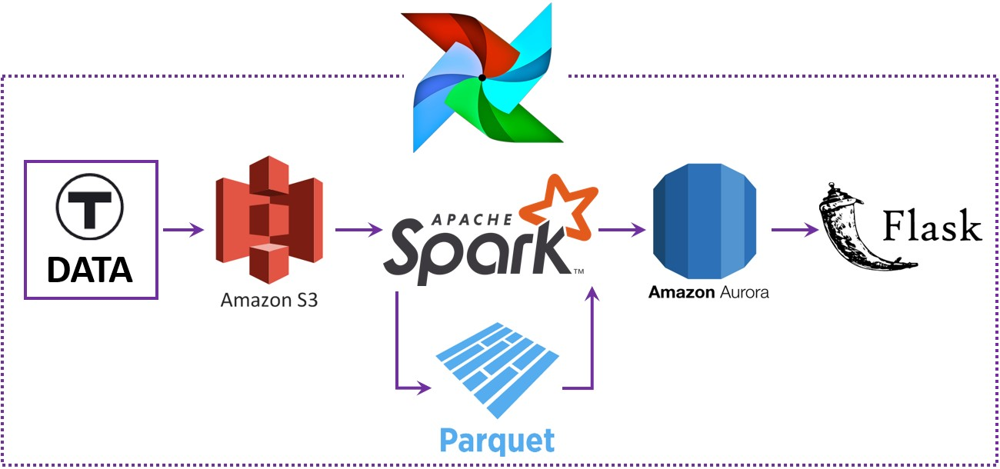

# Arrivals-Watch by Alex Ganin

## Table of Contents
1. [Problem](README.md#problem)
1. [Solution](README.md#solution)
1. [Architecture](README.md#architecture)
1. [Methods and Assumptions](README.md#methods-and-assumptions)
1. [Deployment Instructions](README.md#deployment-instructions)
1. [Directory Structure](README.md#directory-structure)
1. [License](README.md#license)
1. [Contact Information](README.md#contact-information)

## Problem

Urban transportation systems are vulnerable to congestion, accidents, weather, special events, and other costly delays. While the service quality data for the private transportation mode is readily available from large-scale studies such as Texas A&M Institute's [Urban Mobility Scorecard](https://mobility.tamu.edu/umr) the data on public transportation is normally published individually by different agencies in different cities and is often impossible to compare.

## Solution

Most of the public transportation agencies provide real-time information on positions of their vehicles, trip updates, and alerts adhering to the [General Transit Feed Specification (GTFS) Real-Time (RT)](https://developers.google.com/transit/gtfs-realtime). This project takes a stab at building a scalable architecture to collect vehicle position (VP) feeds from public transportation agencies in different cities around the world by focusing on MBTA - Massachusetts Bay Transportation Authority. For illustration, I am using the VP data to provide information on service delays for every combination of stop and route on an hourly basis through a [web user-interface](http://figuresfacts.me/mbta/index). The UI also allows aggregation for all stops, for all routes, for bus routes only, for train routes only as well as skipping weekends or weekdays. Notably, the analyses on the positions data collected can be extended to include measurements of vehicle speeds on route segments or stop durations among others.

## Architecture

The application collects GTFS RT vehicle positions feeds (every 5 seconds) and GTFS schedule tables (once a day and only if there is an update) (both are published by the Massachusetts Bay Transportation Authority). The architecture of the system is described below.

The system in its current implementation on AWS is composed of
* an Airflow server and 2 workers (3 t3.medium instances)
  * Airflow server schedules tasks to run on the workers and provides a web-interface for task management
  * 1st worker is responsible for running data downloads and runs 2 tasks
    * Every minute: a script collects GTFS RT data every 5 seconds during that minute (a thread is started every 5 seconds)
    * Every day: a script collects GTFS data if a new schedule has been published
  * 2nd worker is responsible for data analysis on a Spark cluster. It runs an Airflow task graph once an hour. The graph defines a sequence of tasks where each task depends on the previous task. All of the tasks save their progress information into 3 database tables so that the work is not done more than once. The tasks accomplish the following
    1. Index downloaded real-time vehicle position feeds (Protobufs) in S3 and save the Protobuf metadata into the database
    1. Read the Protobuf files from S3 and insert records into a table for each vehicle position observed, while removing duplicates
    1. Write the vehicle positions into a Parquet file for each date, the day is defined to end at 3am US/Eastern time (when public transportation trips are infrequent) (while the task is run every hour it only does the actual work once a day)
    1. Compute service delays for all trips and all routes and save to a table in the database, aggregate those on an hourly basis and save to a different table in the database (this task is also run every hour but does the actual work only once a day)
* a Spark cluster (6 m4.large instances) responsible for running the data processing tasks described above
* a Flask-powered web server (1 t3.medium instance) responsible for presenting the data for exploration

## Methods and Assumptions

The algorithm combines the GTFS schedule for a given service date and GTFS RT feeds from Parquet for that date using Spark to calculate delays for the illustrative example presented in this project.

* GTFS schedule contains 3 files (see more [here](https://developers.google.com/transit/gtfs)):
  * stops.txt - contains a list of stops with their ids, names and locations
  * trips.txt - contains a list of all trips with all the stops and their sequence number
  * stop_times.txt - contains a list of scheduled times for each stop id and trip id
* Each GTFS RT feed provides a position, a timestamp, and a trip id for 500-1,000 hundreds of MBTA vehicles

### Algorithm
* First the 3 GTFS files are read into a dataframe and joined in Spark based on trip ids and stop ids
* All RT feeds for a given date are read from Parquet into a different dataframe
* Since I observe a trip on a given day in the RT feed, it is assumed that the trip is serviced on that day and I don't use the information from calendar files in GTFS
* Vehicle positions are grouped on trip id to form a list of all positions observed for the trip
* Stop times are grouped on trip id to form a list of all scheduled stop times for the trip
* The two dataframes above are joined on trip ids and a function is run for each joined entry
* The function works as follows:
  * It takes two lists as input: one list defines scheduled stop times and stops and the other contains vehicle positions
  * For each stop, it finds the position where the vehicle was observed closest to the stop
  * To avoid potential edge cases, the scheduled times are shifted 1 day to the future or the past if they differ from the observed time by more than 24 hours
  * It computes the difference between the observed time and the scheduled time
  * It returns a list of rows for each stop on the trip with the calculated values for the vehicle position, the time when it was observed at that position, the distance between the position and the stop, and the estimated delay

**Aggregation of the data for each hour additionally filters out rows where the vehicle was observed farther than 100 meters from the stop location**

## Deployment Instructions

* Create a MySQL or Amazon Aurora (in MySQL mode) database either in Amazon Web Services RDS or on an EC2 instance. The database should be accessible from the EC2 machines to be created as described below.

* Create a Spark Cluster on Amazon Web Services using [the Pegasus tool](https://github.com/InsightDataScience/pegasus) as explained [here](https://blog.insightdatascience.com/how-to-get-hadoop-and-spark-up-and-running-on-aws-7a1b0ab55459)
  * If Python 3.6 is not installed on the cluster, install it by running `peg sshcmd-cluster spark_cluster sudo add-apt-repository ppa:fkrull/deadsnakes`, `peg sshcmd-cluster spark_cluster sudo apt update`, and `peg sshcmd-cluster spark_cluster sudo apt install python3.6-dev`
  * Install and upgrade **pip3** by running `peg sshcmd-cluster spark_cluster sudo apt install python3-pip -y` and `peg sshcmd-cluster spark_cluster sudo python3.6 -m pip install --upgrade pip`
  * Install **virtualenv** by running `peg sshcmd-cluster spark_cluster sudo python3.6 -m pip install virtualenv`
  * Create a virtual environment `peg sshcmd-cluster spark_cluster python3.6 -m virtualenv venv`
  * Upload the requirements.txt file for this project to the home directory of each Spark cluster machine and install all the required packages by running `peg sshcmd-cluster spark_cluster 'source /home/ubuntu/venv/bin/activate && pip install -r /home/ubuntu/requirements.txt'`
  * Set the Python for **pyspark** as follows `peg sshcmd-cluster spark_cluster 'sudo echo PYSPARK_PYTHON=/home/ubuntu/venv/bin/python >> /usr/local/spark/conf/spark-env.sh'` and `peg sshcmd-cluster spark_cluster 'sudo echo PYSPARK_DRIVER_PYTHON=/home/ubuntu/venv/bin/python >> /usr/local/spark/conf/spark-env.sh'`
  * Reboot the cluster `peg sshcmd-cluster spark_cluster sudo reboot` and start Spark `peg service spark_cluster spark start`

* Create and configure an Airflow server and 2 workers, see examples [here](https://corecompete.com/scaling-out-airflow-with-celery-and-rabbitmq-to-orchestrate-etl-jobs-on-the-cloud)
  * Install Google Protocol Buffer libraries on each of the machines `sudo apt install protobuf-compiler`
  * Install dependencies from the requirements.txt file in this repository in a virtual environment (see the Spark configuration instructions for examples)
  * Create an additional queue named _sparks_ for Spark tasks
  * The second worker needs to be additionally configured by editing the file $AIRFLOW_HOME/airflow.cfg and setting the value `default_queue = sparks`
  * Place the file _air_dagbag.py_ in the directory $AIRFLOW_HOME/dags on all the Airflow machines
  * Run `airflow list_dags` and check that the three DAGs for the project are discovered by Airflow on each of the Airflow machines
  * Make sure that the following environment variables are set on each Airflow machine: MYSQL_HOST, MYSQL_USER, MYSQL_PWD, MYSQL_DBNAME, AWS_ACCESS_KEY_ID, AWS_SECRET_ACCESS_KEY, AWS_DEFAULT_REGION
  * Start the Airflow server and workers, e.g., `nohup airflow scheduler > ~/airflow/scheduler.out` for the scheduler or `nohup airflow webserver > ~/airflow/webserver.out` for the web server (see the link above)
  
* Configure a Flask web server on an additional Amazon Web Services EC2 instance
  * Install Google Protocol Buffer libraries on each of the machines `sudo apt install protobuf-compiler`
  * Install dependencies from the requirements.txt file in this repository in a virtual environment (see the Spark configuration instructions for examples)
  * Make sure that the following environment variables are set on the webserver machine: MYSQL_HOST, MYSQL_USER, MYSQL_PWD, MYSQL_DBNAME, AWS_ACCESS_KEY_ID, AWS_SECRET_ACCESS_KEY, AWS_DEFAULT_REGION
  * Configure and start **nginx**
  * Configure **supervisor** to run Flask and start the web server

## Directory Structure

The tool is implemented as a set of scripts for Python 3. Frontend, in addition, contains some HTML, CSS, and Javascript files. The folder structure is as follows

### Root Directory
Name | Role
---- | ----
**.vscode/** | Visual Studio Code project configuration files
**airdags/** | Airflow task definition graphs
**airtasks/** | Airflow tasks scripts
**common/** | Helper classes and functions shared among worker tasks and the frontend
**frontend/** | Frontend Flask web app
**third_party/** | Modified 3rd-party packages and files
**.flaskenv** | Flask dot-environment file, defines FLASK_APP
**.gitignore** | Defines path patterns ignored by Git
**air_dagbag.py** | Allows Airflow to discover task definition graphs in the **airdags/** folder, should be deployed to $AIRFLOW_HOME/dags and modified as described in the file to point to the **airdags/** folder
**frontend_app.py** | Flask application start-up script
**myspark.sh** | Helper Bash script to launch Spark jobs
**requirements.txt** | Python packages requirements file

### **airdags/**
Name | Role
---- | ----
**air_download_mbta_gtfs.py** | Airflow DAG to download MBTA schedule if it's updated
**air_download_mbta_gtfsrt.py** | Airflow DAG to collect the vehicle position feed
**air_process_mbta_hourly.py** | Airflow DAG to update the database and Parquet files

### **airtasks/**
Name | Role
---- | ----
**\_\_init__.py** | Converts this folder to a Python package to simplify imports
**download_mbta_gtfs.py** | Downloads MBTA schedule if it's updated
**download_mbta_gtfsrt.py** | Downloads MBTA real-time vehicle positions
**spk_indexprotobufs.py** | Indexes Protocol Buffer files in S3 and saves the information into the database
**spk_updatedelays.py** | Calculates delays by combining the schedule and vehicle positions and updates the database
**spk_updatevehpos.py** | Updates the database table containing all of the vehicle positions
**spk_writeparquets.py** | Saves Parquet files from Protocol Buffer files in S3

### **common/**
Name | Role
---- | ----
**\_\_init__.py** | Converts this folder to a Python package to simplify imports
**appex.py** | Application-defined exceptions
**dbtables.py** | Database tables and SQL queries to run on them
**gtfs.py** | Helpers to parse GTFS feeds from zip archives
**gtfsrt.py** | Helpers to parse Protocol Buffers files
**queryutils.py** | Helpers to connect to the database and run common queries
**s3.py** | Helpers to work with S3
**settings.py** | Application configuration
**utils.py** | Generic helper functions

### **frontend/**
Name | Role
---- | ----
**api** | Flask blueprints for AJAX calls
**mbta** | Flask blueprints for HTML pages
**static** | CSS and Javascript files
**templates** | Flask templates
**\_\_init__.py** | Converts this folder to a Python package to simplify imports
**math.py** | Functions to smoothen data before returning to client

### **third_party/**

Name | Role
---- | ----
**gtfsscheduleviewer/** | Scripts to display a Marey graph in **schedule_viewer.py**
**transitfeed/** | Library to parse and validate static GTFS feeds
**\_\_init__.py** | Converts this folder to a Python package to simplify imports
**gtfs-realtime.proto** | Main launch script
**schedule_viewer.py** | Stores and computes configuration settings and paths for the tool

Only **transitfeed/shapelib.py** and **gtfs-realtime.proto** are currently needed for the main app

**gtfsscheduleviewer**, **transitfeed**, and **schedule_viewer.py** were downloaded from [a project porting Google's no longer supported **transitfeed** library to Python 3](https://github.com/pecalleja/transitfeed/tree/python3)

**gtfs-realtime.proto** comes from [GTFS Realtime Protobuf reference](https://developers.google.com/transit/gtfs-realtime/gtfs-realtime.proto)

## License

This project is licensed under the MIT License

## Contact Information

**Alex Ganin** - *Initial work* - [GitHub](https://github.com/alxga) [LinkedIn](https://www.linkedin.com/in/alexander-ganin)
